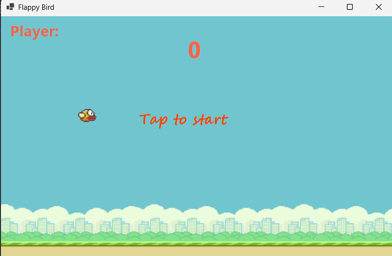

# 🐦 Flappy Bird – Windows Game (C# WinForms)

Một phiên bản đơn giản của game Flappy Bird được viết bằng ngôn ngữ C# với giao diện Windows Forms. Trò chơi mô phỏng lại cách chơi gốc: nhấn phím cách (Space) để điều khiển chú chim bay qua các ống nước.

 <!-- Bạn có thể thêm ảnh demo nếu có -->

## 🚀 Tính năng
- Giao diện đồ họa WinForms đơn giản, dễ chơi
- Hệ thống tính điểm
- Tăng độ khó theo thời gian
- Ghi lại điểm cao nhất
- Âm thanh vui nhộn

## 💻 Công nghệ sử dụng
- C#
- WinForms (.NET Framework)
- Visual Studio 2022

## 🎮 Cách chơi
- Nhấn **phím cách (Space)** để làm chú chim bay lên
- Tránh các chướng ngại vật
- Mỗi lần vượt ống sẽ được 1 điểm

## 📸 Giao diện

## 👨‍💻 Tác giả
Minh Chương – Sinh viên ĐH Sư phạm Kỹ thuật TP.HCM

---
